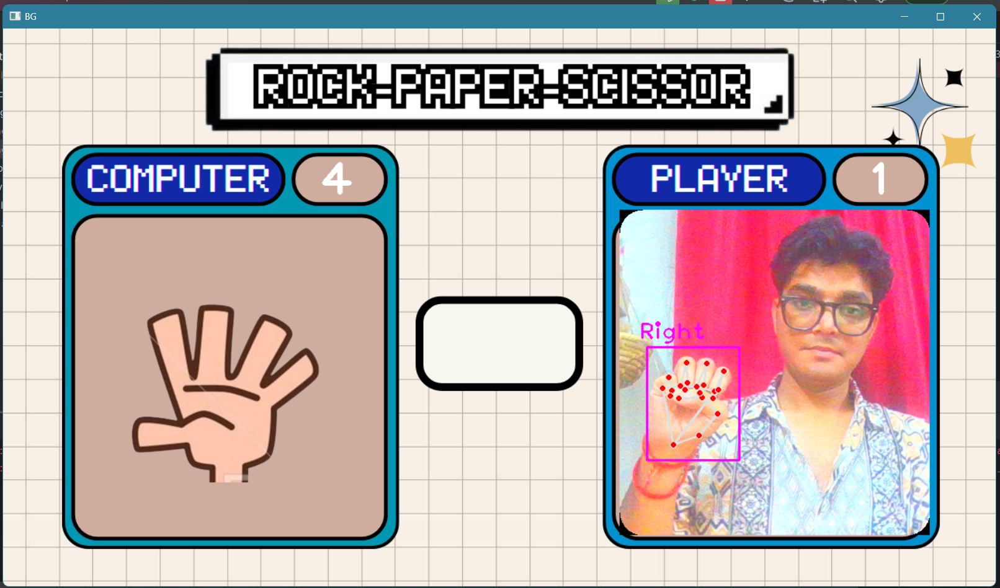

# ✊✋✌️ Hand Gesture Rock Paper Scissors Game

This is a fun, retro-style **Rock-Paper-Scissors game** that you can play using just your hand gestures and your webcam!  
No buttons, no mouse — just pure  -computer vision- and some Python magic.

---

##  What It Does

- Uses **real-time webcam feed** to track your hand
- Detects your gesture using **Google MediaPipe** via **CVZone**
- Matches it against a randomly generated AI move
- Displays visuals, countdown timer, and score
- Gives you that *nostalgic gaming experience* — with a tech twist!

---

##  Tech Stack

| Tool          | Purpose                         |
|---------------|---------------------------------|
| Python        | Core programming language       |
| OpenCV        | Webcam feed & image handling    |
| CVZone        | Simplified hand detection       |
| MediaPipe     | Hand landmarks & gesture logic  |

---
## 🖼️ Preview




##  Setup Instructions

### 1. Clone the repo
```bash
git clone https://github.com/your-username/hand-gesture-rps.git
cd hand-gesture-rps


